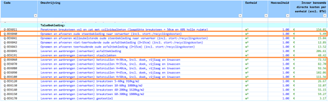

# Kostenfuncties dijkbekleding

De kost van een dijkbekleding maatregel wordt berekend op basis van de eenheidsprijzen uit KOSWAT (bron: 20220606 KOSWAT (LBK202201 v1.0)), die in de volgende tabel worden weergeven. In deze studie maken we gebruik van de informatie die in de gemarkeerde rijen staat:
- De kosten van opnemen en afvoeren van de oude steenbekleding
- De kosten van leveren en aanbrengen van betonzuilen (de nieuwe steenbekleding), afhankelijk van de toplaagdikte

De kost van een maatregel heeft betrekking alleen op de kosten van de nieuwe steenbekleding, hier worden er twee gevallen onderscheiden:
- De nieuwe steenbekleding wordt aangebracht op een locatie waar al een steenbekleding ligt
- De nieuwe steenbekleding wordt aangebracht op een grasbekleding (dat geldt voor gevallen met een nieuwe overgang)

Om de kosten per vlak te bepalen wordt eerst de oppervlakte (A) van het te versterken dijkvlak berekend:

A=L√((X_b-X_o)^2+(Z_b-Z_o)^2 )

Waarin:
- Zo – onder niveau van het vlak [m+NAP]
- Zb – boven niveau van het vlak [m+NAP]
- Xo – x-coördinaat van Zo [m]
- Xb – x-coördinaat van Zb [m]
- L – lengte van het dijkvak [m]

Voor het geval waarin de nieuwe steenbekleding met toplaagdikte D aangebracht wordt op een locatie waar al een steenbekleding ligt wordt de kost per dijkvlak als volgt afgeleid:

Kost per dijkvlak = A * (Kostafvoeren + Kostzuilen(D)) * (1 + BTW)

Voor het geval waarin de nieuwe steenbekleding met toplaagdikte D aangebracht wordt op een locatie met gras wordt de kost voor het opnemen en afvoeren van oude steenbekleding niet meegerekend:

Kost per dijkvlak = A * Kostzuilen(D) * (1 + BTW)

Waarin:
- Kostafvoer – kost van het opnemen en afvoeren van de oude steenbekleding [in euro per m2 excl. BTW]
- Kostzuilen – kost van het leveren en aanbrengen van betonzuilen, afhankelijk van de toplaagdikte [in euro per m2 excl. BTW]
- D – toplaagdikte nieuwe steenbekleding [m]
- BTW = 1.21

De totale kosten worden berekend door de kosten per vlak bij elkaar op te tellen. Voor de kosten in 2100 wordt een discontovoet gebruikt.
