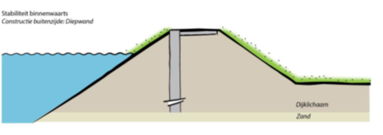

# Diepwand

Voor een diepwand wordt een soortgelijke foutenboom gehanteerd. Voor stabiliteit wordt aangenomen is dat de faalkans van de diepwand 10-8 is, en de faalkans van dijk met functionerende diepwand ook 10-8. Voor piping wordt aangenomen dat het watervoerende pakket (bij functioneren van de diepwand) volledig wordt afgesloten en piping dus niet mogelijk is.

Voor overslag wordt aangenomen dat de kering in 2075 voldoet aan de doorsnede-eis voor overslag (24% van de faalkansruimte). Hiervoor worden geen extra kosten meegenomen.

