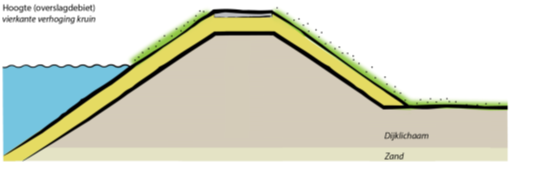
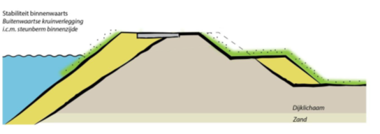
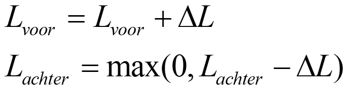

# Versterking in grond

Parameterisatie van een grondversterking gebeurt o.b.v. een kruinverhoging en/of een bermverbreding. In principe gaat een versterking binnenwaarts, maar het kan ook buitenwaarts. Dan wordt de kruin verlegd, en de afgegraven grond hergebruikt.

Bij een kruinverhoging wordt simpelweg de kruin verhoogd met de betreffende verhoging. Aangenomen wordt dat alle taluds gelijk blijven. Zie onderstaande figuur:

Bij een bermverbreding Δb wordt de berm verbreed met Δb. Dat wordt gedaan door de x-coordinaten van de Einde Berm Landzijde (EBL) en BinnenTeen (BIT) te verschuiven met Δb. Aanname is dat alle taluds verder gelijk blijven.

Wanneer ook buitenwaarts versterkt kan worden wordt dit zover mogelijk gedaan, zie onderstaande figuur:

De kosten worden, op basis van volume en lengte van het dijkvak bepaald met de DetermineCosts functie. Daarvoor worden unit_costs uit unit_costs.csv gebruikt (worden in de config ingelezen, maar dat kan netter). Op termijn kunnen we dit vervangen door een koppeling met KOSWAT.

Bij een versterking in grond heeft dit invloed op de betrouwbaarheid voor overslag (bij kruinverhoging), en stabiliteit en piping (bij bermverbreding). De invloed van bermverbreding op stabiliteit is invoer, en wordt gegeven met de fberm, die de relatieve toename van de betrouwbaarheid per meter berm aangeeft.

Voor piping wordt de bermverbreding meegenomen als een toename van de kwelweg. De kwelweglengte L bestaat uit 3 delen: de kwelweglengte in het voorland L1 (intredepunt tot buitenteen), de kwelweglengte van de dijkzate L2 (buitenteen tot binnenteen) en de kwelweglengte in het achterland L3 (binnenteen tot uittredepunt). Er geldt:

  
Bij een versterking in grond wordt vanaf de binnenteen binnenwaarts versterkt met een berm. Dat betekent dat Lvoor wordt vergroot. Wanneer geldt dat Lachter >0 meter is wordt de kwelweglengte echter niet effectief langer. Bij bermverlenging ΔL geldt dus:
  

