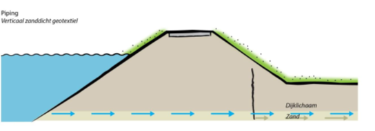
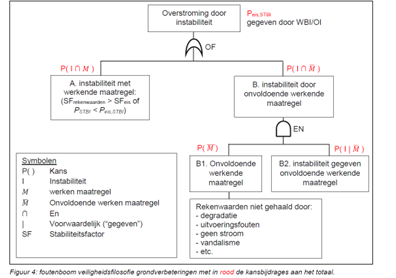
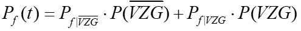

# Verticaal Zanddicht Geotextiel (VZG)

Verticaal Zanddicht Geotextiel (VZG) is een innovatieve manier om 'piping' te voorkomen en daarmee verzakking of bezwijking van de dijk. Het geotextiel laat wel water door, maar geen zand. Het VZG wordt horizontaal vanaf de dijklichaam tot aan de zandlaag geplaatst, zie figuur hieronder.

Een VZG sluit falen door piping vrijwel uit, maar heeft geen invloed op stabiliteit en overslag. Voor een VZG gebruiken we onderstaande foutenboom (NB: deze is algemeen voor grondverbeteringen, maar ook voor VZG van toepassing):

De veiligheid voor piping wordt gelijkgesteld aan: 

Daarbij worden de volgende kansen aangenomen:

Voor  geldt de pipingfaalkans zonder VZG (dus de originele som voor het dijkvak, eventueel uitgebreid met een berm).
