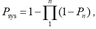

# Optimalisatiealgoritme

Voor een optimalisatie worden de volgende stappen doorlopen:
- In make _optimization_input worden de dataframes met maatregelen vertaald naar matrices voor de optimalisatie. Daarbij worden maatregelen voor geotechnische mechanismen en hoogte gesplitst.
- Vervolgens wordt het initiële risico bepaald
- Daarna wordt stapsgewijs bepaald welke maatregel het beste is. Daarvoor worden achtereenvolgens:
  - De kosten van de maatregelen bepaald
  - Het risico door falen door overslag/geotechnische mechanismen ná uitvoering van een individuele maatregel
  - Vervolgens wordt de BC-ratio op 2 manieren bepaald:
    1.	De BC-ratio (kosten/baten) van elke individuele maatregel
    2.	Vervolgens wordt apart voor overslag gekeken naar de optimale combinatie van maatregelen voor overslag. Dit gebeurt met de functie OverflowBundling. De reden dat dit apart moet is dat de faalkans voor overslag i.t.t. geotechnisch falen niet bepaald wordt door de formule  , maar het zwakste vak dominant is. Zodoende kan het voorkomen dat het verhogen van de kruin van 1 vak een zeer lage BC-ratio heeft, maar van 2 vakken juist een hoge (bijv. als 2 vakken nagenoeg dezelfde β hebben).
  - Tot slot wordt vergeleken of een individuele maatregel (1) of een combinatie (2) de hoogste BC-ratio heeft. Deze maatregel wordt dan uitgevoerd, en de beginsituatie voor de volgende optimalisatiestap wordt aangepast met deze maatregel.
- Wanneer het max aantal iteraties is bereikt, of de BC-ratio van de beste maatregel < 0.1 stopt de optimalisatie.
- Vervolgens worden met de routine writeGreedyResults de resultaten opgeslagen.

Omdat tot een BC-ratio van 0.1 wordt geoptimaliseerd is de laatste stap van de optimalisatie niet economisch optimaal. Met de functie makeSolution kan op 2 manier de optimale set maatregelen worden bepaald:
- ‘SatisfiedStandard’ is de set maatregelen die in 2075 aan de trajecteis voldoet
- ‘Optimal’ is de set maatregelen die economisch optimaal is (minimale totale kosten)

In het algemeen functioneert de optimalisatieroutine goed, de meeste crashes worden veroorzaakt door ondeugdelijke invoer (bijv nan’s in de β van maatregelen)
