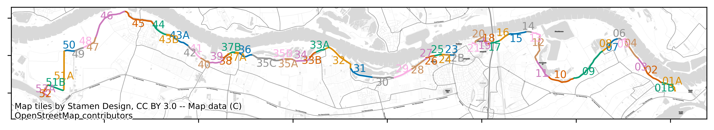

# Van beoordeling naar invoer

## Overzicht van de workflows

De eerste stap in het voorbereiden van gegevens voor berekeningen met de VRTOOL is het genereren van een vakindeling. Deze vakindeling is de basis van de analyses, en moet aan de volgende voorwaarden voldoen:
* De vakindeling voor alle faalmechanismen is gelijk.
* Voor elk faalmechanisme is 1 mechanismeberekening beschikbaar, voor minimaal 1 relevant faalmechanisme.


## Basisinvoerbestanden

Er zijn XX basisinvoerbestanden die hier worden toegelicht.

### Vullen van een invoerbestand voor vakindeling
De basis voor het genereren van de vakindeling is het invoerbestand `Vakindeling.csv`. Dit bestand heeft de volgende kolommen die moeten worden gevuld:

| Kolom       	|           	| Beschrijving                                                                                                                                                                                 	      |
|-------------	|-----------	|-----------------------------------------------------------------------------------------------------------------------------------------------------------------------------------------------------|
| objectid    	| Verplicht 	| Unieke identifier (moeten verschillende getallen zijn)                                                                                                                                       	      |
| vaknaam     	| Verplicht 	| Nummer/naam van het dijkvak (moet uniek zijn, kan identiek zijn aan OBJECTID)                                                                                                                     	 |
| m_start     	| Verplicht 	| startpunt op lijn van traject                                                                                                                                                         	             |
| m_eind      	| Verplicht 	| eindpunt op lijn van traject                                                                                                                                                          	             |
| in_analyse  	| Verplicht 	| Vak meenemen in analyse of niet (TRUE/FALSE)                                                                                                                                                 	      |
| van_dp      	| Optioneel 	| Begrenzing dijkpaalnummers                                                                                                                                                                   	      |
| tot_dp      	| Optioneel 	| Begrenzing dijkpaalnummers                                                                                                                                                                   	      |
| {}          	| Optioneel 	| Doorsnede voor een mechanisme. Wanneer dit niet wordt ingevuld moet dit later worden afgeleid uit bijv een shapefile met uittredepunten. Daarvoor zijn specifieke workflows beschikbaar. 	          |
| opmerkingen 	| Optioneel 	| extra opmerkingen, moet altijd de laatste kolom zijn                                                                                                                                         	      |

Belangrijk bij het genereren van de vakindeling zijn met name de `m_start` en `m_eind` parameters. 

**Let op:** 
- De separator in de csv files moet een komma zijn, en het teken voor decimalen een punt.
- De m_eind en m_start van alle vakken moeten overeen aan elkaar aansluiten


### Vullen van een invoerbestand voor Hydra-Ring

`HR_default.csv`.


## Workflows 

### Workflow Genereren van een vakindeling voor de VRTOOL

Op basis van de vakindeling invoerbestand (`Vakindeling.csv`) bestand kan vervolgens met de volgende python code een shapefile worden gegenereerd: [`generate_vakindeling_workflow.py`](https://github.com/Deltares/VRSuiteUtils/blob/main/preprocessing/workflows/generate_vakindeling.py) uit de `VRUtils` GitHub.

De shapefile van het betreffende traject wordt gedownload van de webserver van het Nationaal Basisbestand Primaire Waterkeringen (NBPW), en vervolgens conform de m-waarden wordt opgeknipt. Een aandachtspunt hier is dat de richting van het opgeknipte traject volgens `Vakindeling.csv` anders kan zijn dan de richting van het traject volgens (NBPW). 

**Let op:** De trajectlengte moet gelijk zijn aan de som van alle vaklengtes.

Het is ook mogelijk om het betreffende traject zelf in te voeren door 'XXXXXX'

#### Draaien van de berekeningen voor vakindeling

Deze workflow kan worden aangeroepen vanuit de terminal (bijv. via Anaconda Prompt) door middel van het commando:

    python '/pad/naar/generate_vakindeling_workflow.py' 'traject-1' '/pad/naar/vakindeling.csv'

Waarbij:
- ``'/pad/naar/generate_vakindeling_workflow.py'`` vervangen moet worden met de pad naar de python code
- ``'traject-1'`` vervagen moet worden door een officiële trajectnaam 
- ``'/pad/naar/vakindeling.csv'`` vervangen moet worden met de pad moet verwijzen naar de vakindeling.csv.

**Let op** dat de paden relatief zijn tot de locatie in de console.

#### Uitvoer van de code voor vakindeling
De uitvoer bestaat uit 2 bestanden die in dezelfde map als `vakindeling.csv` worden weggeschreven:
* `Vakindeling_traject.geojson` waarin de opgeknipte vakindeling is opgeslagen.
* `Vakindeling_traject.png` waarin een figuur met de vakindeling is opgeslagen.

Een voorbeeld van een vakindeling volgend uit de workflow is onderstaand weergegeven:



### Workflow Hydra-Ring

Als voorbereiding op analyses met de `VRTOOL` moet een aantal berekeningen gemaakt worden met `Hydra-Ring`. Belangrijk is om een correcte installatie van een recente versie van Hydra-Ring te hebben, bijvoorbeeld door de laatste versie van Riskeer te installeren.
De berekeningen worden uitgevoerd via de `VRSuiteUtils`. [Installatieinstructies](link) zijn hier te vinden.

Als eerste moet de benodigde invoer worden klaargezet in het bestand `HR_default.csv`. Dit bevat alle informatie voor de berekeningen voor overslag en waterstand. 
Het is ook mogelijk dit bestand automatisch te vullen op basis van een shapefile met beoordelingsgegevens, en de shapefile van de vakindeling. 
Zie daarvoor de workflow [automatisch genereren van invoer voor Hydra-Ring berekeningen](link).

#### Berekeningen voor waterstand

#### Voorbereiden van de berekeningen
Als input voor de `VRTOOL` moeten voor 2023 en 2100 frequentielijnen van de waterstand worden afgeleid. De locaties zijn opgenomen in het bestand HR_default.csv.
Daarnaast moet een map worden gemaakt met daarin de submappen 2023 en 2100, volgens de volgende structuur:
```
Waterstandsberekening
├── 2023/
└── 2100/
```
In de mappen moeten de juiste hydraulische database bestanden worden geplaatst. In 2023 voor WBI2017, in 2100 voor het gewenste klimaatscenario.
Dit betreft zowel een HRD database, een config database, en de HLCD database met de juiste statistiek.

#### Draaien van de berekeningen
Het draaien van de berekeningen wordt gedaan via `preprocessing/workflows/hydraring_waterlevel_workflow.py`.
Hierin moeten 3 paden worden gespecificeerd:
* `work_dir`: deze verwijst naar de hoofdfolder (`Waterstandsberekening`)
* `HydraRing_path`: deze verwijst naar de installatiefolder van Hydra-Ring (meestal een submap van de installatiefolder van Riskeer)
* `database_paths`: een `list` met daarin de subfolders waarin de hydraulische databases staan.

Alle opgegeven paden moeten als pathlib.Path object worden opgegeven. Dus `Path(r'mijnpad')`. Let daarbij op dat niet afgesloten moet worden met een `\`.
Vervolgens kunnen door het runnen van `hydraring_waterlevel_workflow.py` alle waterstandsberekeningen worden uitgevoerd. Resultaten worden weggeschreven in subfolders met de naam van de doorsnede.

#### Interpreteren en verder verwerken van de uitvoer
Resultaat van de berekeningen zijn frequentielijnen voor 2023 en 2100.
Verdere instructies volgen.

### Berekeningen voor overslag
Voor overslag zijn iets meer gegevens nodig. De structuur is identiek aan die van waterstandsberekeningen, maar nu moeten de gegevens in de volgende structuur worden opgegeven:
```
Waterstandsberekening
├── 2023/
├── 2100/
└── prfl/
```

In de folder `prfl` moeten profielbestanden worden opgenomen voor alle door te rekenen doorsnedes. De naam van het bestand moet daarbij overeenkomen met de doorsnede uit het *.csv invoer bestand.

Verder werkt deze workflow identiek aan die van waterstand, via het bestand `hydraring_overflow_workflow.py`.

