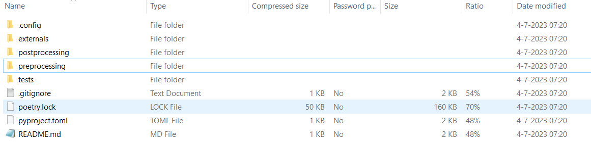

# Preprocessing


## Downloaden
De preprocessing wordt uitgevoerd met een python script die "VRUtils" is genoemd. Deze is te downloaden via [een ZIP-file](https://filesender.surf.nl/?s=download&token=46802ef1-fece-4da6-bffc-5fafc123b01f). Pak de zip file met de VRTool preprocessing repository uit (liefst op een locatie met een kort pad). De ZIP-file bevat de volgende files:

 

## Preprocessing installatie

Nadat de ZIP file is geopend en alle documenten klaar liggen moet nog een [virtual enviroment](https://docs.python.org/3/library/venv.html) worden geinstalleerd. Een vituaal enviroment zorgt ervoor dat de script op alle computers werkt. Volg de volgende stappen om een virtual environment aan te maken:

### Stap 1: Open de Anaconda Prompt
 

### Stap 2:	Verander de directory in Anaconda Prompt

Verander de directory naar de map waar de VRTool preprocessing repository is geplaatst met behulp van de volgende commandline. Vervang "C:/link_naar_ZIP_file_map" met de locatie van de map waar de ZIP file is uitgepakt.

```
cd C:/link_naar_ZIP_file_map
```

### Stap 3: Creëer de environment: 
```
conda env create -f .config\environment.yml -p .env
```

### Stap 4: Activeer de environment: 
```
conda activate .env/
```

### Stap 5: Installeer dependencies: 
```
poetry install
```

#### Let op
- Bij Stap 5 lukt de installatie soms niet ineens, probeer het dan nogmaals: ```poetry install```
- Als er zich een probleem voordoet bij Stap 5 met ```peewee```, installeer deze dan handmatig door de volgende commandline in te typen: ```pip install peewee==3.16.2```. Doe daarna nog eens: ```poetry install```
