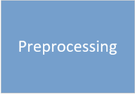

Veiligheidsrendement
============================================

Waar gaat het over?
-------------------------------------------

Waarom is het nuttig?
-------------------------------------------

Hoe ga je aan de slag?
-------------------------------------------

I apologize for the confusion. It seems I misunderstood your requirement. In reStructuredText, there is no direct way to create a table with images and links using the standard syntax. However, you can achieve a similar result by using custom HTML within the raw directive. Here's an example:

rst
Copy code
.. raw:: html

   <table>
     <tr>
       <td>
         
       </td>
       <td>
         
       </td>
       <td>
         
       </td>
     </tr>
   </table>

+---------------+---------------+---------------+
.. figure:: test_linkpreprocessing.PNG
   :target: Preprocessing/test.md
|
.. figure:: test_linkVRTool.PNG
   :target: Preprocessing/test.md
|
.. figure:: test_linkpostprocessing.PNG
   :target: Preprocessing/test.md
+---------------+---------------+---------------+
